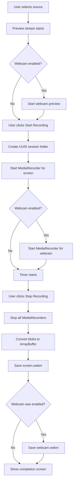

# Screen Recorder

> A premium Electron desktop application for recording screens and webcams with a refined, professional interface.


## 📖 Overview

Screen Recorder is a cross-platform desktop application built with Electron that enables users to capture their screen and webcam simultaneously. Each recording session is saved as separate video files in a uniquely identified folder, making it easy to organize and manage your recordings.

**Key Highlights:**
- 🎥 **Dual Recording** — Capture screen and webcam independently
- 🖼️ **Visual Source Picker** — Browse all screens and windows with live thumbnails
- 💾 **Organized Storage** — UUID-based session folders for easy management
- 🎨 **Premium UI** — Liquid Glass design with warm gold accents
- ⚡ **Fast & Lightweight** — Built with electron-vite for optimal performance

---

## ✨ Features

### Core Functionality
- **Screen/Window Selection** — View and select from all available screens and application windows with real-time thumbnail previews
- **Webcam Toggle** — Enable or disable webcam recording on demand
- **Independent Recordings** — Screen and webcam are saved as separate `.webm` files for maximum flexibility
- **Live Timer** — Real-time recording duration display (HH:MM:SS format)
- **Session Management** — Automatic UUID-based folder creation for each recording session
- **Recording History** — Browse past recordings directly from the sidebar
- **Quick Access** — One-click "Open Folder" button to access your recordings

### User Experience
- **Permission Handling** — Intelligent detection and guidance for macOS screen recording permissions
- **Error Recovery** — Graceful handling of permission denials and mid-recording interruptions
- **Responsive UI** — Fluid animations and smooth transitions throughout
- **Keyboard Navigation** — Full keyboard accessibility support

---

## 🚀 Getting Started

### Prerequisites

- **Node.js** 18.x or higher
- **npm** 9.x or higher
- **macOS** 10.15+ / **Windows** 10+ / **Linux** (Ubuntu 20.04+)

### Installation

```bash
# Clone the repository
git clone https://github.com/iampratt/ScreenRecorder.git
cd ScreenRecorder

# Install dependencies
npm install

# Start development server
npm run dev
```

### Building for Production

```bash
# Build the application
npm run build

# The compiled app will be in the out/ directory
```

---

## 📚 Usage Guide

### 1. Grant Permissions (macOS Only)

On first launch, macOS will prompt you to grant **Screen Recording** permission:

1. Click "Open Settings" in the app sidebar (if sources are empty)
2. Navigate to **System Settings → Privacy & Security → Screen Recording**
3. Enable the toggle for **Electron** or your terminal application
4. **Restart the app** for changes to take effect

### 2. Select a Source

- Browse available screens and windows in the left sidebar
- Click on any thumbnail to preview and select it
- The main preview area will show a live feed of your selection

### 3. Configure Webcam (Optional)

- Click the **"Webcam"** toggle button in the controls bar
- Your webcam will appear as a picture-in-picture overlay
- Toggle off anytime to disable webcam recording

### 4. Start Recording

- Click **"Start Recording"** to begin
- The timer will start counting and a red "REC" indicator will appear
- Both screen and webcam (if enabled) are recorded simultaneously

### 5. Stop & Save

- Click **"Stop Recording"** when finished
- A completion screen will appear showing:
  - Session ID (first 8 characters of UUID)
  - Files saved: `screen.webm` and `webcam.webm` (if webcam was enabled)
- Click **"Open Folder"** to view your recordings in Finder/Explorer

### 6. Access Past Recordings

- View your recording history in the **"Recordings"** section of the sidebar
- Click any session to open its folder

---

## 🏗️ Architecture

### Project Structure

```
screen-recorder/
├── src/
│   ├── main/
│   │   └── index.ts          # Main process (IPC handlers, file I/O)
│   ├── preload/
│   │   └── index.ts          # Context bridge (secure API exposure)
│   └── renderer/
│       ├── index.html        # Application shell
│       └── src/
│           ├── main.ts       # Renderer entry point
│           ├── app.ts        # App controller (UI logic, state)
│           ├── recorder.ts   # MediaRecorder wrappers
│           ├── styles.css    # Design system & styles
│           └── env.d.ts      # TypeScript declarations
├── electron.vite.config.ts   # Build configuration
├── package.json
└── tsconfig.json
```

### Technology Stack

| Layer | Technology | Purpose |
|-------|-----------|---------|
| **Runtime** | Electron 33.3.1 | Cross-platform desktop framework |
| **Language** | TypeScript 5.7 | Type-safe development |
| **Build Tool** | electron-vite | Fast HMR and bundling |
| **Recording** | MediaRecorder API | Browser-native video capture |
| **Styling** | Vanilla CSS | Custom design system |
| **Fonts** | Bodoni Moda, Jost, JetBrains Mono | Premium typography |

### IPC Communication

The app uses Electron's IPC (Inter-Process Communication) for secure communication between the main and renderer processes:

**Main Process Handlers:**
- `get-sources` — Fetch available screens/windows via `desktopCapturer`
- `create-session` — Generate UUID and create session folder
- `save-recording` — Write video blob to disk
- `open-folder` — Open session folder in file explorer
- `get-sessions` — List all recording sessions
- `open-settings` — Open macOS privacy settings (permission helper)

**Renderer → Main:**
```typescript
window.electronAPI.getSources()
window.electronAPI.createSession()
window.electronAPI.saveRecording(sessionId, type, buffer)
```

### Recording Flow



---

## 🎨 Design System

### Color Palette (Liquid Glass)

| Token | Hex | Usage |
|-------|-----|-------|
| `--bg-deep` | `#0a0908` | Deepest background |
| `--bg-base` | `#1c1917` | Primary background (stone) |
| `--bg-surface` | `#292524` | Elevated surfaces |
| `--accent` | `#ca8a04` | Gold accent (primary actions) |
| `--text-primary` | `#fafaf9` | High-contrast text |
| `--danger` | `#ef4444` | Recording indicator |

### Typography

- **Display:** Bodoni Moda (serif) — Elegant, luxurious
- **UI Text:** Jost (sans-serif) — Clean, modern
- **Monospace:** JetBrains Mono — Code, timers, technical info

---

## 📁 File Storage

Recordings are saved in the `videos/` directory with the following structure:

```
videos/
├── 4a12ffac-b243-4fa3-8c9f-1123dfeaa342/
│   ├── screen.webm
│   ├── webcam.webm
│   └── meta.json (optional, for custom names)
├── 7f3e8d2a-9c1b-4e5f-a6d7-8b9c0d1e2f3a/
│   └── screen.webm
└── ...
```

**Location:**
- **Development:** `<project-root>/videos/`
- **Production:** `<userData>/videos/` (e.g., `~/Library/Application Support/screen-webcam-recorder/videos/` on macOS)

---

## 🔧 Troubleshooting

### No sources appear in the sidebar

**Cause:** macOS screen recording permission not granted.

**Solution:**
1. Click "Open Settings" button in the app
2. Enable Screen Recording permission for Electron
3. Restart the app

### Webcam shows "Permission denied" error

**Cause:** Camera access blocked by system or browser.

**Solution:**
1. macOS: **System Settings → Privacy & Security → Camera** → Enable for Electron
2. Restart the app

### Recording stops unexpectedly

**Cause:** App closed mid-recording or memory constraints.

**Solution:**
- The app attempts to save partial recordings on close
- For long sessions (1hr+), consider stopping and restarting to avoid memory issues

### Video files won't play

**Cause:** Unsupported codec or incomplete recording.

**Solution:**
- Ensure you have a modern video player (VLC, QuickTime, Chrome)
- `.webm` files use VP8/VP9 codecs — most players support this
- If the file is 0 bytes, the recording may have failed

---

## 🛠️ Development

### Available Scripts

```bash
# Start development server with hot reload
npm run dev

# Build for production
npm run build

# Type-check without emitting files
npm run typecheck

# Preview production build
npm start
```

### Project Configuration

- **Main Process:** `tsconfig.node.json`
- **Renderer Process:** `tsconfig.web.json`
- **Build Config:** `electron.vite.config.ts`

### Adding New Features

1. **Main Process (IPC):** Add handlers in `src/main/index.ts`
2. **Preload:** Expose APIs in `src/preload/index.ts`
3. **Renderer:** Update UI logic in `src/renderer/src/app.ts`
4. **Types:** Add TypeScript definitions in `src/renderer/src/env.d.ts`

---

## ⚠️ Known Limitations

| Limitation | Details | Workaround |
|-----------|---------|------------|
| **No Audio** | Currently video-only (no system audio or mic) | Use external audio recorder |
| **WebM Format** | Recordings saved as `.webm` (VP9/VP8) | Convert to MP4 using FFmpeg if needed |
| **Memory Usage** | Entire recording buffered in RAM before saving | Avoid sessions longer than 1 hour |
| **macOS Permissions** | Requires Screen Recording permission | Follow setup guide above |
| **Mid-recording Close** | Best-effort save on app close | Avoid closing app during recording |

---

## 🗺️ Roadmap

- [ ] Audio recording (system audio + microphone)
- [ ] MP4 export option
- [ ] Streaming recording (write to disk in chunks)
- [ ] Custom save location
- [ ] Video trimming/editing
- [ ] Annotation tools (draw on screen during recording)
- [ ] Hotkey support (global shortcuts)
- [ ] Cloud upload integration

---

## 📄 License

MIT License - see [LICENSE](LICENSE) for details.

---

## 🙏 Acknowledgments

- Built with [Electron](https://www.electronjs.org/)
- Powered by [electron-vite](https://electron-vite.org/)
- Icons from [Lucide](https://lucide.dev/)
- Fonts from [Google Fonts](https://fonts.google.com/)

---

**Made with ❤️ by [Pratt](https://github.com/iampratt)**
